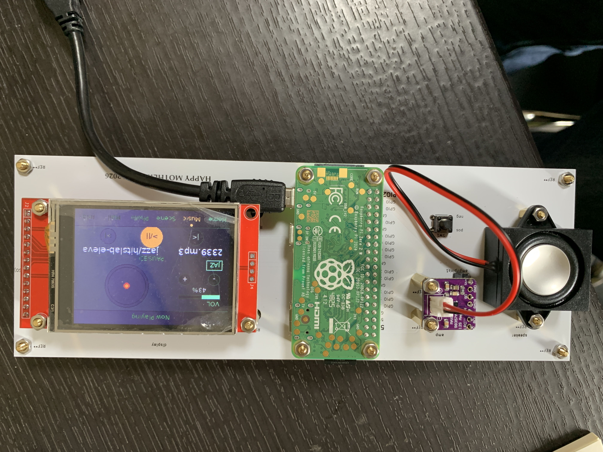

# 🎵 Retro Music Player

A Raspberry Pi Zero 2W-based music player with a retro aesthetic. Features a touch display showing the current track, animated landscape scenes, and a clock — all controllable via a web UI from any device on your network.

Built as a Mother's Day gift 💐

---



---

## ✨ Features

| Feature | Status |
|---------|--------|
| OS setup & SSH access | ✅ |
| MPD music playback | ✅ |
| ILI9341 SPI touch display | ✅ |
| Auto-start on boot | ✅ |
| Tailscale remote access | ✅ |
| Web UI (Flask) | ✅ |
| Touch panel controls | ✅ |
| Multi-screen UI (Home / Music / Clock / Photo / Mail / Scene) | ✅ |
| Landscape animation (auto-launch during playback) | ✅ |
| Photo gallery & slideshow | ✅ |
| Message feature (Web UI → display) | ✅ |
| Sky color changes by time of day | ✅ |
| AirPlay (shairport-sync) | ✅ |
| MAX98357A amp wiring & audio output | ✅ |
| C++ effects processing | ❌ |


---

## 🛠 Hardware

| Component | Details |
|-----------|---------|
| Raspberry Pi Zero 2WH | Main board |
| MAX98357A | I2S amplifier |
| ILI9341 2.4" display | SPI touch display (XPT2046 controller) |
| Speaker | 3W / 4Ω, JST-PH 2mm connector |
| microSD 32GB | Storage |
| Tactile switch | Power on/shutdown button |

---

## 🔌 Wiring

### ILI9341 Display + Touch (XPT2046)

| LCD Pin | Pi GPIO | Physical Pin | Notes |
|---------|---------|-------------|-------|
| VCC | 3.3V | Pin 1 | |
| GND | GND | Pin 6 | |
| CS | GPIO8 (CE0) | Pin 24 | Display CS |
| RESET | GPIO25 | Pin 22 | |
| DC | GPIO24 | Pin 18 | |
| SDI (MOSI) | GPIO10 | Pin 19 | |
| SCK | GPIO11 | Pin 23 | |
| LED | 3.3V | Pin 17 | |
| SDO (MISO) | not connected | — | |
| **T_DO** | **GPIO9** | **Pin 21** | Touch MISO |
| T_CS | GPIO7 (CE1) | Pin 26 | Touch CS |
| T_IRQ | GPIO17 | Pin 11 | Touch interrupt |
| **T_CLK** | **GPIO11 (shared)** | **Pin 23** | Shared with SCK |
| **T_DIN** | **GPIO10 (shared)** | **Pin 19** | Shared with MOSI |

> ⚠️ T_CLK and T_DIN are branched from Pin 23 and Pin 19 respectively.

### MAX98357A Amplifier

| Amp Pin | Pi GPIO | Physical Pin |
|---------|---------|-------------|
| VDD | 5V | Pin 2 |
| GND | GND | Pin 6 |
| BCLK | GPIO18 | Pin 12 |
| LRC | GPIO19 | Pin 35 |
| DIN | GPIO21 | Pin 40 |
| SD | 3.3V | — |

### Tactile Switch (Power Button)

```
Tactile switch
├── Terminal 1 → GPIO3 (Pin 5)
└── Terminal 2 → GND  (Pin 6)
```

**Button behavior:**
- Short press (device off) → Boot
- Long press (≥ 0.5s, device on) → Shutdown

---

## 💻 Software & File Structure

```
/home/pi/
├── main.py              ← Main loop (touch & display control)
├── touch.py             ← XPT2046 touch reader
├── app.py               ← Flask Web UI server
├── display.py
├── templates/
│   └── index.html       ← Web UI HTML
├── scenes/
│   ├── common.py        ← Shared colors, fonts, nav
│   ├── home.py          ← Home screen
│   ├── music.py         ← Music screen (playback controls)
│   ├── clock.py         ← Clock screen
│   ├── mail.py          ← Mail screen (message display)
│   ├── photo.py         ← Photo gallery & slideshow
│   ├── scene_select.py  ← Landscape selection screen
│   ├── landscape.py     ← Landscape animation
│   ├── rain.py
│   └── dance.py
├── music/               ← Music files (.mp3)
├── photos/              ← Photo files
└── messages.json        ← Message history
```

---

## ⚙️ OS & Setup

- **OS**: Raspberry Pi OS Bookworm Lite 64-bit (2024-11-19)
  - ⚠️ Avoid the latest Trixie (2025-12-04) — a bug in Imager prevents SSH/Wi-Fi settings from being applied correctly.
- **Default user**: `pi`

---

## 📦 Dependencies

```bash
sudo apt install python3-pip python3-dev python3-pil fonts-dejavu mpd mpc -y
pip3 install luma.lcd flask python-mpd2 spidev numpy --break-system-packages
```

---

## 🔧 Auto-Start (systemd)

### Display service (`main.py`)

```ini
# /etc/systemd/system/display.service
[Unit]
Description=Display Service
After=network.target

[Service]
ExecStart=/usr/bin/python3 /home/pi/main.py
WorkingDirectory=/home/pi
Restart=always
User=pi

[Install]
WantedBy=multi-user.target
```

### Flask Web UI service

```ini
# /etc/systemd/system/flask.service
[Unit]
Description=Flask Web UI
After=network.target

[Service]
ExecStart=/usr/bin/python3 /home/pi/app.py
WorkingDirectory=/home/pi
Restart=always
User=pi

[Install]
WantedBy=multi-user.target
```

### Enable both services

```bash
sudo systemctl enable display flask
sudo systemctl start display flask
```

---

## 🌐 Web UI

Access the Web UI from any browser on the same network:

```
http://<raspberry-pi-ip>:5000
```

**Features:** Music playback control, file management, photo upload, message sending, system controls.

> **Tip:** If the port is busy, run:
> ```bash
> sudo kill $(sudo fuser 5000/tcp 2>/dev/null)
> sudo systemctl start flask
> ```
> Or add this alias to `~/.bashrc` for convenience:
> ```bash
> alias fixflask='sudo kill $(sudo fuser 5000/tcp 2>/dev/null); sudo systemctl start flask'
> ```

---

## 🎵 MPD Configuration

### `/etc/mpd.conf` changes

```
music_directory "/home/pi/music"
bind_to_address "any"

audio_output {
    type        "alsa"
    name        "I2S Audio"
    device      "dmixer"
    mixer_type  "software"
}
```

### Permissions

```bash
chmod 755 /home/pi
sudo chown -R mpd:audio /home/pi/music
```

### Basic playback commands

```bash
mpc ls | mpc add   # Add all tracks
mpc play           # Play
mpc next           # Next track
mpc current        # Show current track
mpc stop           # Stop
```

---

## ➕ Adding Music

**Via SCP (recommended):**
```bash
scp ~/Downloads/song.mp3 pi@<raspberry-pi-ip>:/home/pi/music/
```

**Via Web UI:**
1. Web UI → Files tab → Upload files
2. Player tab → click "Scan Library"

> Either way, press **Scan Library** after adding files.

---

## 🔊 MAX98357A Troubleshooting

### Problem: No audio output

**Symptom:** Device appears in `aplay -l` but no sound.

**Root cause:** GPIO18 (BCLK) is not set to `PCM_CLK` by the overlay automatically.

**Diagnosis:**
```bash
pinctrl get 18,19,20,21
# GPIO18 should show PCM_CLK — if it shows "output", this is the bug
```

**Fix:**

1. Edit `/boot/firmware/config.txt`:
```
dtparam=i2s=on
# dtparam=audio=on   ← comment this out (conflicts with I2S)
dtoverlay=max98357a,no-sdmode
```

2. Create a systemd service to force GPIO18 to `PCM_CLK` on boot:

```ini
# /etc/systemd/system/i2s-fix.service
[Unit]
Description=Fix GPIO18 for I2S
After=multi-user.target

[Service]
Type=oneshot
ExecStartPre=/bin/sleep 3
ExecStart=/usr/bin/pinctrl set 18 a0
RemainAfterExit=yes

[Install]
WantedBy=multi-user.target
```

```bash
sudo systemctl enable i2s-fix
sudo systemctl start i2s-fix
```

> **Note:** If the display service reconfigures GPIO18 as output, restart both services:
> ```bash
> sudo systemctl restart display && sudo systemctl restart i2s-fix
> ```

---

### Problem: Buzzing / popping noise

**Root cause:** MAX98357A pops/buzzes when the I2S clock starts or stops.

**Fix:** Use ALSA `dmix` and continuously play silence to keep the I2S clock alive.

**1. Create `/etc/asound.conf`:**
```
pcm.dmixer {
    type dmix
    ipc_key 1024
    ipc_perm 0666
    slave {
        pcm "hw:0,0"
        rate 48000
        channels 2
    }
}
pcm.!default {
    type plug
    slave.pcm "dmixer"
}
```

**2. Create `/etc/systemd/system/aplay-silence.service`:**
```ini
[Unit]
Description=Play silence to keep I2S clock alive
After=sound.target

[Service]
ExecStart=/usr/bin/aplay -D dmixer -t raw -r 48000 -c 2 -f S16_LE /dev/zero
Restart=always

[Install]
WantedBy=multi-user.target
```

```bash
sudo systemctl enable aplay-silence
sudo systemctl daemon-reload
sudo reboot
```

---

## 📻 AirPlay Setup

```bash
sudo apt install shairport-sync -y
```

That's it — `shairport-sync` auto-starts on boot.

**Usage:**
1. Open Control Center on iPhone
2. Tap the AirPlay icon
3. Select `raspberrypi`
4. Play music from any app (Apple Music, Spotify, YouTube, etc.)

---

## 🖐 Touch Calibration

```python
X_MIN, X_MAX = 251, 3735
Y_MIN, Y_MAX = 220, 3842
```

Coordinate transform in `touch.py` (X/Y swap + X invert):
```python
x = SCREEN_W - int((y_raw - Y_MIN) / (Y_MAX - Y_MIN) * SCREEN_W)
y = int((x_raw - X_MIN) / (X_MAX - X_MIN) * SCREEN_H)
```

---

## 🗒 Known Issues

- Buzzing/popping noise is mitigated by the `aplay-silence` workaround above.
- If the Web UI port 5000 is occupied by another process (e.g. shairport-sync), change the Flask port to 5001.
- `systemd-networkd-wait-online.service` can block boot for 2+ minutes — disable it if startup is slow:
  ```bash
  sudo systemctl disable systemd-networkd-wait-online.service
  ```

---

## 📐 PCB

Designed in KiCad. Files are in the [`hardware/`](hardware/) directory.

- `music_player.kicad_pcb` — PCB layout
- `music_player.kicad_sch` — Schematic
- `gerber/` — Gerber files for PCB fabrication (e.g. JLCPCB)

---

## 📄 License

MIT License
